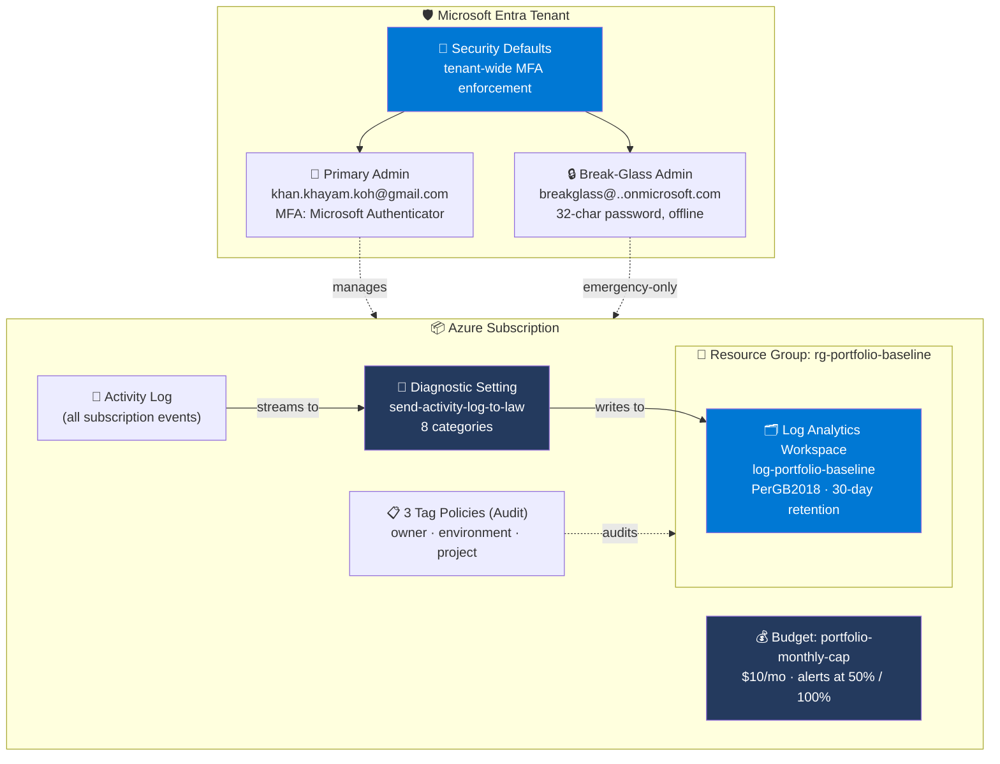

# Project 01 — Azure Tenant Bootstrap

> **Microsoft Cybersecurity Architect Portfolio** · Project 01 of 9
> Paired cert: **AZ-900 Azure Fundamentals** · ✅ Passed 2026-05-12 ([verify](https://learn.microsoft.com/en-us/users/khayamkhan-6558/credentials/2ebe91411c01a460))
> Shipped: 2026-05-13
> By **Khayam Khan** · SOC Analyst → Cloud Security Architect · 🇵🇭 Philippines · [LinkedIn](https://www.linkedin.com/in/khankhayamk/)

---

## 1. What I Built

A **hardened Azure tenant baseline** — the foundational state that every later project in this portfolio (Projects 02–09) builds on. It is the configuration that turns a fresh "I just clicked sign-up on Azure Free" account into something a security engineer would call **safe to use**: MFA enforced on every account, a break-glass admin pattern, cost guardrails, a central log destination, governance via tag policy, and a complete audit trail.

It also exists as **infrastructure-as-code** (Bicep) and is **drift-validated** — running `az deployment sub what-if` against the deployed state shows zero changes across all 7 resources, proving the code accurately represents reality.

---

## 2. Problem Solved

**Problem**: Every cloud security failure traces back to a missing baseline. Default Azure sign-ups ship with:
- Global Admin password-only (no MFA → credential phishing wins immediately)
- No cost cap (cryptomining attacks or runaway resources can drain credit cards in hours)
- No central logging (incident response has nothing to investigate with)
- No tag enforcement (shadow IT, orphan resources, blame-the-other-guy outages)
- No second Global Admin (if you lose your phone, you lose your tenant forever)

**Who hurts**: Solo developers learning Azure, startups bootstrapping their first subscription, and enterprises spinning up dev/sandbox tenants under the radar. All of them assume "I'll harden it later" — *later* is when the incident happens.

**Why it matters**: A SOC analyst who can spot misconfigurations in their *own* environment is the one who catches them in production. The bootstrap is the first attack surface — and the easiest one to fix.

---

## 3. Technologies Used (and Why)

| Technology | Why I chose it | Alternative considered |
|---|---|---|
| **Microsoft Entra ID** | Native to Azure; required for identity controls + Conditional Access in later projects | Okta (would add cost + integration overhead) |
| **Microsoft Authenticator** | Push-notification MFA, free, no extra hardware | YubiKey FIDO2 (better, but requires hardware purchase + spare key) |
| **Security Defaults** | Free tenant-wide MFA enforcement without Entra P1 | Conditional Access (more flexible, requires P1 at $6/user/month) |
| **Azure Policy (built-in)** | Declarative governance, no custom code | Custom policy definitions (overkill for "tag must exist") |
| **Log Analytics Workspace (PerGB2018)** | Free first 5 GB/month, KQL-queryable, native destination for every Azure data source | Splunk / Elastic (license cost, foreign to AZ-500/SC-200 cert path) |
| **Azure Activity Log → LAW (diagnostic setting)** | Permanent control-plane audit; foundation for every detection in P02–P09 | Default 90-day Activity Log retention (gone after 3 months) |
| **Cost Management Budgets** | Native cost alerts with email notifications, free | Custom Logic App with cost API (more code, more risk of breaking) |
| **Bicep (subscription-scope)** | Microsoft-native IaC, cleaner syntax than ARM JSON | Terraform (would work, but adds another tool + state file to manage) |
| **`az deployment sub what-if`** | Drift detection without committing changes — the "test before push" of IaC | Diff-by-eye comparing portal to code (error-prone and unprofessional) |

---

## 4. Architecture Diagram



A polished NotebookLM-generated infographic (Azure Blue theme, sketch-note style) — recruiter-facing summary in a single image:


---

## 5. Trade-offs & Decisions

### What I chose NOT to do (and why)

| Skipped | Why |
|---|---|
| **Conditional Access policies** | Requires Entra ID P1 ($6/user/month). Security Defaults covers 90% of the value for $0. Conditional Access is on the roadmap for Project 06 (Entra ID Zero Trust). |
| **Privileged Identity Management (PIM)** | Requires Entra ID P2 ($9/user/month). Just-in-time admin access is critical at enterprise scale; for a 2-user portfolio tenant, it's premature optimization. |
| **Custom domain on the tenant** | Requires Entra P1 + actual domain ownership. Default `khankhayamkohgmail.onmicrosoft.com` works for portfolio purposes. |
| **Defender for Cloud Standard plans** | Per-resource cost (~$15/server/month). The free baseline (`ASC Default` initiative) is enabled and provides recommendations. Defender Standard plans get enabled per-project as needed (starting P02). |
| **Tag policy in `Deny` mode** | Started in `Audit` to avoid blocking legitimate experimentation. Will migrate to `Deny` after 30 days of clean compliance — standard "audit-first, enforce-later" pattern. |
| **Sentinel workspace** | A SIEM on top of an empty tenant generates zero value. Will be added in Project 05 when there are detection rules and incidents to investigate. |
| **Network resources (VNet, NSG, firewall)** | Zero workloads to protect yet. Project 03 will introduce the hub-and-spoke network. |

### What I'd do differently with more time/budget

- **Hardware security keys (FIDO2)** for both admin accounts. Push notifications are vulnerable to MFA fatigue attacks; hardware keys are not.
- **Separate phones for primary and break-glass MFA.** Currently the break-glass account is intended to be enrolled on a second device on first emergency use — a stricter implementation pre-enrolls on Day 1.
- **`Deny` mode tag policy from Day 1** — if I were doing this in production where pristine baseline matters more than experimentation speed.

### Known weaknesses / limitations

- The break-glass account uses **the same MFA enforcement path** as the primary admin (Security Defaults). A single-phone-loss is mitigated by offline-stored recovery codes, but a true enterprise pattern uses Conditional Access with an MFA-excluded break-glass account stored in a physical safe.
- **Cost alerts are email-only.** No SMS, no webhook to a SOC channel. Fine for a solo portfolio; insufficient for any team setting.
- **Log Analytics retention is 30 days** (free tier ceiling). Real IR investigations often need 90 days. Will reconsider for SC-200-aligned Project 05.

---

## 6. Threat Model / Security Scope

### What this project defends against (in scope)

- **Credential phishing leading to admin takeover** — MFA blocks password-only auth
- **Permanent admin lockout** — break-glass account provides a recovery path
- **Cost-based attacks (cryptomining, runaway resource spawning)** — budget alerts fire within hours
- **Shadow IT / untagged resource sprawl** — tag policy audits surface non-compliance
- **Loss of forensic history** — Activity Log → Log Analytics provides permanent audit trail

### What this project does NOT defend against (out of scope, honesty)

| Out of scope | Why | Addressed in |
|---|---|---|
| Identity-level attacks (token theft, AiTM phishing) | Requires Entra P2 features (Identity Protection, PIM) | Project 06 |
| Workload compromise (web shells, malware on VMs) | No workloads yet | Project 02 (Defender) + Project 04 (Security Hardening) |
| Network-level attacks (lateral movement, exfil) | No network yet | Project 03 (Hub-and-Spoke) + Project 04 |
| Data exfiltration | No data yet | Project 07 (Purview Data Protection) |
| Advanced persistent threats (long-dwell adversaries) | Requires Sentinel detection rules and active SOC ops | Project 05 (Sentinel SOC Build-Out) |

### MITRE ATT&CK techniques covered

| Technique | ID | Control in this project |
|---|---|---|
| Valid Accounts: Cloud Accounts | T1078.004 | MFA via Security Defaults blocks password-only authentication |
| Create Account: Cloud Account | T1136.003 | Activity Log → Log Analytics captures every user creation event, queryable via KQL |
| Resource Hijacking | T1496 | Budget alert at $5 fires within hours of unusual compute spend |
| Account Manipulation | T1098 | Activity Log captures every RBAC change for forensic review |
| Indicator Removal: Clear Cloud Logs | T1070.008 | Activity Log streamed to LAW immediately — local clear has no effect on retained copy |

---

## 7. Attack Scenarios

The SOC differentiator: thinking offensively about what was built.

| Attack | MITRE | Defense in this project | Evidence / Log |
|---|---|---|---|
| Attacker phishes primary admin's password, attempts portal login | T1078.004 | MFA via Authenticator app blocks — attacker doesn't have the push approval | `SigninLogs` table in LAW captures failed MFA challenge (post Project 02 Sentinel ingest) |
| Attacker compromises a managed identity and creates a backdoor user | T1136.003 | Activity Log captures the user creation event with caller identity | `AzureActivity \| where OperationNameValue == "Microsoft.AAD/users/write"` |
| Attacker provisions GPU VMs for cryptomining after gaining subscription access | T1496 | Budget alert at $5 (50% of $10 cap) fires via email to admin | `AzureActivity \| where ResourceProvider == "Microsoft.Compute" and ActivityStatusValue == "Success"` |
| Insider deletes the Log Analytics workspace to hide tracks | T1070.008 | Activity Log entry of the delete operation is sent to LAW *before* the delete completes; even after deletion, the entry persists in the Activity Log (90 days, ungated) | `AzureActivity \| where OperationNameValue contains "workspaces/delete"` |
| Untagged resource created (shadow IT or quick test) | n/a | Tag policy in Audit mode surfaces the resource in compliance reports | Azure Policy → Compliance → resource list with `non-compliant` state |

> Note: Detection queries above are illustrative — they will become *active* detection rules in Project 05 (Sentinel SOC Build-Out). This project lays the data plumbing that makes those queries possible.

---

## 8. Proof It Works

11 evidence screenshots captured during the build, in `screenshots/`:

| # | File | Shows |
|---|---|---|
| 01 | `01-entra-tenant-overview.png` | Tenant ID, primary domain, Entra ID Free license, 1 user |
| 02 | `02-subscription-overview.png` | Subscription ID, Owner role, $0.02 spend, Secure Score 100% |
| 03 | `03-mfa-two-step-verification-on.png` | Two-step verification: ON |
| 04 | `04-security-defaults-enabled.png` | Security Defaults: Enabled (recommended) |
| 05 | `05-global-admins-with-break-glass.png` | Both Global Admins listed (primary + break-glass) |
| 06 | `06-budget-portfolio-monthly-cap.png` | $10/month budget active, alerts configured |
| 07 | `07-rg-portfolio-baseline.png` | Resource group with 3 required tags |
| 08 | `08-log-analytics-workspace.png` | LAW Active, PerGB2018, tagged |
| 09 | `09-tag-policy-assignments.png` | All 3 tag policies assigned + auto-applied ASC Default initiative |
| 10 | `10-diagnostic-settings-activity-log.png` | All 8 Activity Log categories → LAW |
| 11 | `11-bicep-whatif-no-drift.png` | 🏆 **`Resource changes: 7 no change.`** — Bicep IaC validated against deployed state |

The "money shot" is **screenshot 11** — provable, point-in-time evidence that the IaC code (`infra/baseline.bicep`) faithfully represents the deployed Azure state.

---

## 9. Quantified Results

- **2 Global Admins** (primary + break-glass), both MFA-enrolled
- **0 password-only sign-ins** possible (Security Defaults blocks them)
- **0 untagged resources** in `rg-portfolio-baseline` (policy enforcement in Audit mode)
- **8 of 8** Activity Log categories captured to permanent storage
- **$10/month** budget cap with alerts at **$5** and **$10**
- **5 declarative resources** managed via Bicep (RG, LAW, diagnostic setting, 3 tag policies, budget)
- **7 resources analyzed by `what-if`**, **0 drift** between code and reality
- **30-day** Log Analytics retention (within free tier — 5 GB/month free)
- **~$2/month** idle cost (entirely within Free Tier credits)
- **1 weekend** to ship (~6 hours active work)

---

## 10. How to Reproduce

### Prerequisites

- An Azure account (Free Trial or Pay-As-You-Go) with **Owner** rights on a subscription
- A personal email + phone for MFA
- Microsoft Authenticator installed on a smartphone
- Azure CLI ≥ 2.50 + Bicep CLI ≥ 0.20 (or use Azure Cloud Shell — pre-installed)

### Deploy from Bicep (recommended)

```bash
# Clone
git clone https://github.com/khayamkkhan/azure-cs-01-tenant-bootstrap.git
cd azure-cs-01-tenant-bootstrap/infra

# Authenticate + select subscription
az login
az account set --subscription "<YOUR_SUBSCRIPTION_NAME>"

# Dry-run (validates without deploying)
az deployment sub what-if \
  --location eastus \
  --template-file baseline.bicep \
  --parameters alertEmail=YOUR_EMAIL@example.com

# Real deploy
az deployment sub create \
  --location eastus \
  --template-file baseline.bicep \
  --parameters alertEmail=YOUR_EMAIL@example.com \
  --name "baseline-$(date +%Y%m%d-%H%M%S)"
```

Takes ~60 seconds. See [`infra/README.md`](infra/README.md) for parameter customization (region, budget, retention).

### Manual steps (cannot be Bicep-ified)

After the Bicep deploy:

1. **Enable Security Defaults**: Entra ID → Properties → Manage security defaults → Enabled
2. **Enroll Microsoft Authenticator** for the primary admin (myaccount.microsoft.com → Security info)
3. **Create the break-glass account** with a 32-char random password (do not put credentials in Bicep — see [`BASELINE.md`](BASELINE.md) "Recovery / Disaster Plan")

### Teardown

The baseline is **permanent** by design (Projects 02–09 depend on `log-portfolio-baseline`). Idle cost is ~$2/month.

If you must tear it down (e.g., closing the Azure account):

```bash
az group delete --name rg-portfolio-baseline --yes
az deployment sub delete --name <DEPLOYMENT_NAME>
# Manually remove policy assignments + budget via portal or:
az policy assignment delete --name require-tag-owner --scope /subscriptions/<SUB_ID>
az policy assignment delete --name require-tag-environment --scope /subscriptions/<SUB_ID>
az policy assignment delete --name require-tag-project --scope /subscriptions/<SUB_ID>
```

---

## 11. Cost to Run

| Item | Cost |
|---|---|
| Log Analytics ingestion (Activity Log only) | < $0.10 / month (well within 5 GB/mo free tier) |
| Log Analytics retention | $0 (30 days is free for first 31 days of new workspaces) |
| Resource Group | $0 |
| Azure Policy assignments | $0 |
| Budget alerts | $0 |
| Diagnostic settings | $0 |
| Microsoft Entra ID Free (1 directory, 50K users) | $0 |
| **Total idle cost** | **~$2 / month** (worst case under Pay-As-You-Go after Free Trial) |

Cost discipline note: the `portfolio-monthly-cap` budget alert at **$5** would fire if cost crosses 50% of the $10 cap — i.e., it should never fire under normal operation. Any alert means something needs investigation.

---

## 12. Cert Mapping

This project maps to **AZ-900 Azure Fundamentals**, specifically:

| AZ-900 Exam Domain | How this project demonstrates it |
|---|---|
| **Domain 1: Cloud concepts** (25–30%) | Subscription as billing/admin unit; resource groups as logical container; tenant as identity boundary |
| **Domain 2: Azure architecture & services** (35–40%) | Resource Group + Log Analytics deployment; Activity Log as a platform service |
| **Domain 3: Azure management & governance** (30–35%) | Azure Policy (tag enforcement), Cost Management (budget), RBAC (Global Admin role), Microsoft Entra ID (identity), Resource locks would slot here in P03 |

**Cert verification**: [Microsoft Learn credential](https://learn.microsoft.com/en-us/users/khayamkhan-6558/credentials/2ebe91411c01a460) · Credential ID `2EBE91411C01A460` · Earned 2026-05-12

This baseline becomes the **substrate** for the AZ-500, SC-200, and SC-300 projects (Projects 04–06) — the Activity Log, Log Analytics workspace, and identity hygiene established here are reused throughout.

---

## 13. Lessons Learned

**What surprised me:**

- **Portal-created policy assignments use UUID names** even when you type a friendly name — Azure stores the friendly name as `displayName`. Bicep-created assignments use the friendly name as the actual resource name. Discovered this via `what-if` drift detection; reconciled by deleting the portal-created versions and letting Bicep redeploy with proper names.
- **`subscriptionResourceId()` is not the right helper for built-in policy definitions** — they live at tenant scope. Use `tenantResourceId()`. Cost me one failed deployment to learn.
- **Cloud Shell's "No storage required" mode is the right pick for one-off IaC validation** — ephemeral, free, instantly available, no provisioning friction.
- **Budget notification dictionary keys are auto-generated by Azure** in the format `<thresholdType>_<operator>_<threshold>_Percent`. My custom keys (`warning_50pct`, `stop_100pct`) caused what-if to flag drift until I matched Azure's convention.

**What I'd do differently:**

- Write the Bicep **first**, then deploy from Bicep — instead of clicking-then-coding. The clicking-then-coding path required reconciling drift (policy names, budget keys); the IaC-first path would have been clean from the start.
- Verify default property values (like LAW retention) **before** assuming Azure will match my Bicep declarations.

**What the AZ-900 course didn't teach me:**

- **The drift-detection workflow** (`what-if`) — fundamental to senior IaC work, not in the cert curriculum.
- **The break-glass admin pattern** — a real-world enterprise hygiene practice that AZ-900 mentions briefly but never operationalizes.
- **The "audit-first, enforce-later" policy rollout pattern** — emerges from doing it, not from reading slides.

---

## 14. Tags

`#azure` · `#azure-security` · `#bicep` · `#iac` · `#microsoft-entra-id` · `#log-analytics` · `#azure-policy` · `#cost-management` · `#mfa` · `#security-defaults` · `#break-glass-admin` · `#mitre-attack` · `#az-900` · `#cloud-security` · `#soc-analyst` · `#cybersecurity-portfolio` · `#microsoft-cybersecurity-architect`

---

## Project metadata

| Field | Value |
|---|---|
| Status | ✅ Shipped 2026-05-13 |
| Effort | ~6 hours (active build) + ~2 hours (IaC + docs) |
| Cost to build | $0 (Free Tier) |
| Cost to maintain | ~$2 / month |
| Next project | [Project 02 — Defender + Sentinel Tour](#) (paired with SC-900) |

---

*This is Project 01 of the [Microsoft Cybersecurity Architect Portfolio](https://github.com/khayamkkhan?tab=repositories) — 9 hands-on Azure projects mapped to 9 Microsoft certs, from AZ-900 through SC-100.*

---

> ### A note on this README
>
> This README was drafted with AI assistance (Claude) for prose polish, formatting consistency, and section structure. The **technical work** behind it — every Azure resource configured, every Bicep line written, every drift detected and reconciled, every screenshot captured, every architectural decision — was done by me. Disclosing AI assistance in documentation is the right default for transparency, and it should be the norm rather than the exception.
